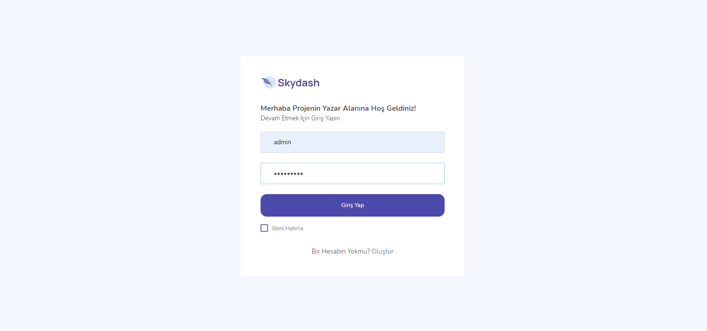

Bu projede, ASP.NET Core 5.0 kullanarak bir web projesi geliştirdim. Projede, Entity Framework Core, Repository Design Pattern, Fluent Validation, Restful API, deploy, GitHub yönetimi, MVC, Unit of Work, Charts, Ajax, Reporting, Identity ve Rolleme gibi çeşitli teknolojileri kullandım. Projeyi, Default, Author ve Admin olmak üzere üç ana panel içeren bir portföy yapısına benzeterek tasarladım.

